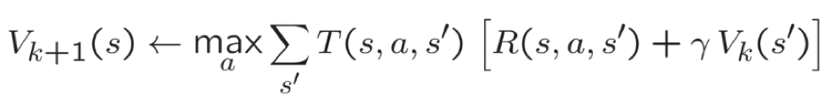
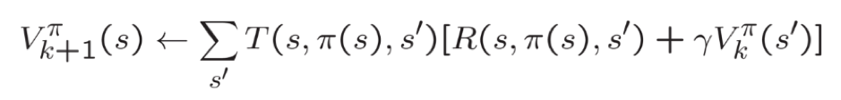
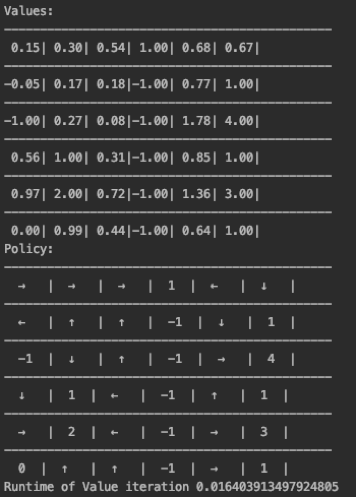
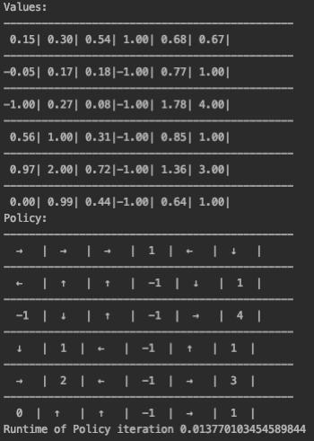

# Reinforcement-learning

For given Grid World with details of the grid world. Solve it using value iteration, and using policy iteration. Compare the running times of both.

# Value Iteration

Value iteration includes: finding optimal value function + one policy extraction. There is no repeat of the two because once the value function is optimal, then the policy out of it should also be optimal (i.e. converged). By initialising the grid to 0 and then applying the value iteration on that. In each iteration value is calculated of that particular state using the below mentioned equation. Once convergence point is reached i.e there is no change in value than we break from the loop.

I have used a direction list which I am using to get the preferred action and then using it to calculate the optimal value and according to preferred action I have applied the noise accordingly.

# Policy Iteration

Policy iteration includes: policy evaluation + policy improvement, and the two are repeated iteratively until policy converges. Here I am initialising the grid by value 0 and initialising random policy(direction) and storing it in policy dictionary for each state and then I am applying the below mentioned equation until the convergence is reached i.e there is no change in policy than we break from loop.

For Policy convergence by going through all the possible direction for a particular states we can find the best direction and then doing it iteratively we achieve to the policy convergence. 

# Output 

**Value Iteration**

**Policy Iteration**

